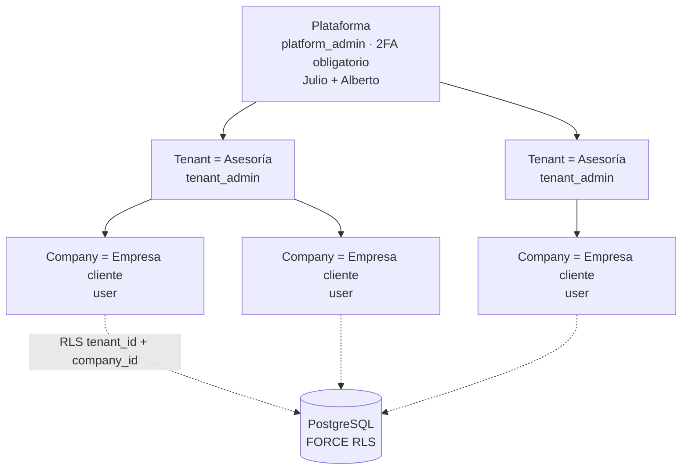
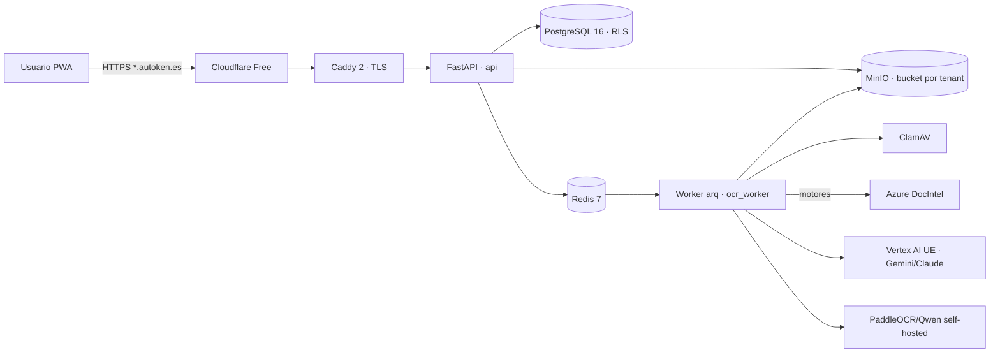
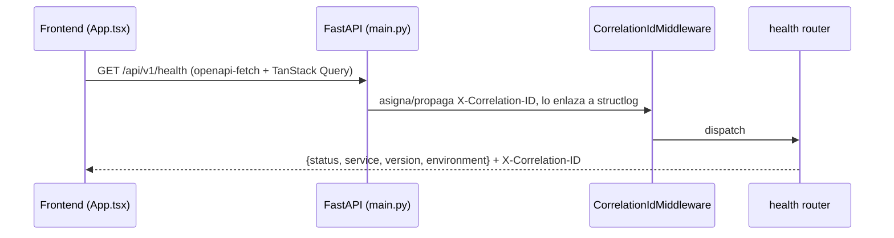
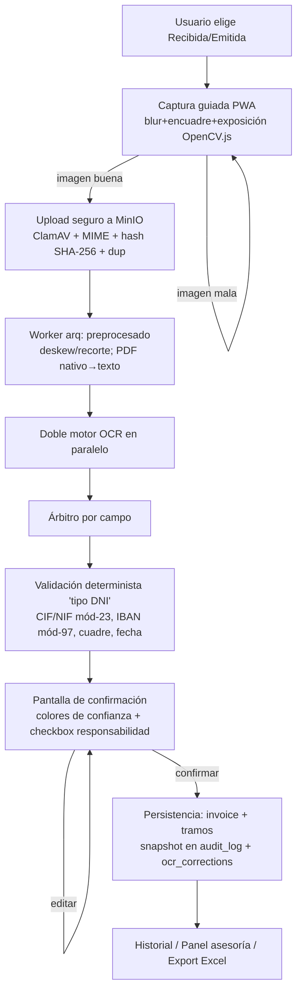
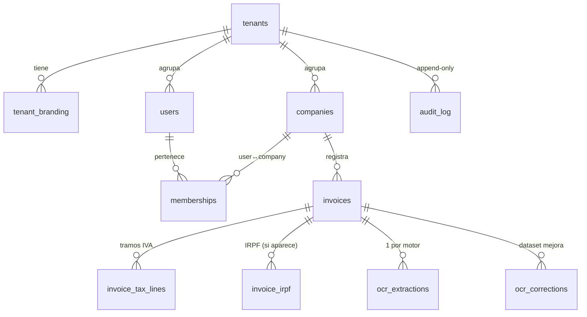
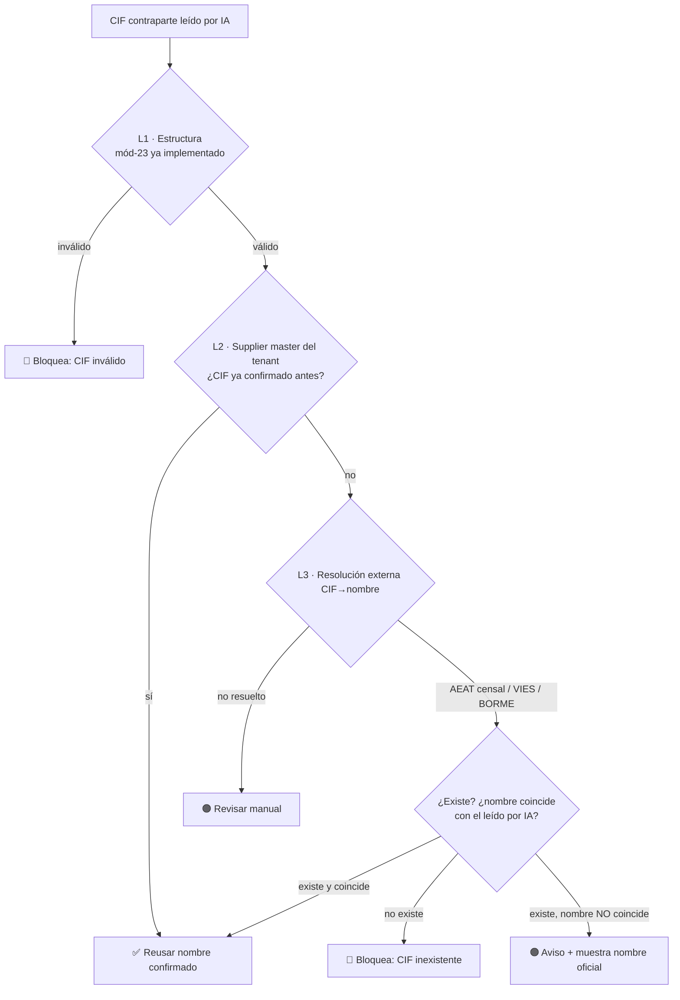

# AUDITORÍA TÉCNICA — Autoken Facturas v2 (Setex v2)

> **Documento de auditoría profunda y onboarding técnico.**
> Generado el 2026-06-18 por auditoría de código + documentación + investigación de mercado.
> Rol del autor: arquitecto senior · tech lead de onboarding · auditor técnico · documentalista de producto.
>
> **Alcance:** análisis no destructivo (solo lectura). No se ha modificado código.
> **Fuente de verdad del proyecto:** `PLAN_MAESTRO_AUTOKEN_FACTURAS_V2_v1.2.md` (v1.2, 513 líneas) + `CLAUDE.md`.
> **Estado del repo auditado:** rama `feature/1.2-bench-skeleton`, último commit `cc92a3b` (ADR-0010, PR #13).
>
> ⚠️ **Lectura imprescindible:** este proyecto está en **FASE 0 completada → inicio de FASE 1 (POC OCR)**. La
> documentación describe un producto **objetivo** muy ambicioso; el **código existente es un esqueleto** más un
> único módulo de dominio real (verificación determinista de identificadores). A lo largo del informe se
> distingue siempre entre **[IMPLEMENTADO]**, **[ESQUELETO]** y **[PLANIFICADO]** para no confundir el plan con
> la realidad ejecutable.

---

## 1. Resumen ejecutivo

**Autoken Facturas v2** (nombre comercial heredado: *Setex v2*) es la **reconstrucción completa** de una app
de digitalización de facturas que hoy existe en producción como *Setex v1* (Node.js, monolito sin prácticas).
La v2 se reconcibe como **plataforma SaaS multi-asesoría white-label**: una misma base de código sirve a N
asesorías ("tenants"), cada una con su marca, sus empresas-cliente y **aislamiento total de datos**, y cuyo
corazón es un **pipeline OCR/IA de 4 capas** con una regla anti-alucinación innegociable.

| Dimensión | Estado |
|---|---|
| **Madurez** | Fase 0 (fundación) **cerrada** ✅ (`tag fase-0-done`); Fase 1 (POC OCR) **en arranque**. |
| **Código de negocio implementado** | 1 módulo: verificación determinista de NIF/NIE/CIF/IBAN + cuadre aritmético (`ocr/verification.py`, 26 tests). Bench OCR a medio construir (`ocr/bench/`, WIP). |
| **Resto del backend** | Esqueleto FastAPI (healthcheck, logging, config, middleware). Sin BD conectada, sin auth, sin tenancy, sin modelos. |
| **Frontend** | Esqueleto React/Vite/PWA que solo pinta el healthcheck. |
| **Calidad/ingeniería** | **Excelente** para la fase: CI con 5 gates, gitleaks pre-commit + CI, mypy strict, ruff, Conventional Commits, gitflow, ADRs, runbooks, registro central. |
| **Documentación** | **Sobresaliente y poco habitual**: el PLAN MAESTRO es un documento de ejecución detallado, vivo y trazable. |
| **Riesgo principal** | El producto vale lo que valga su OCR. La Fase 1 (bench con facturas reales) es el **gate que decide la viabilidad** y aún no se ha ejecutado (faltan entregables de Julio: cuentas Google/Mistral y dataset anotado). |

**Veredicto de auditoría:** proyecto **muy bien gobernado**, con disciplina de ingeniería superior a la media
del mercado para su tamaño, y con decisiones arquitectónicas correctas y documentadas. El riesgo no está en la
ingeniería sino en el **núcleo funcional aún no validado** (precisión real del OCR, en especial el **CIF de la
contraparte** — ver §18 y el bloque nuevo de requisitos en §20.4 y en el PLAN MAESTRO §11.8).

---

## 2. Qué hace la aplicación

### 2.1 Problema de negocio
Las asesorías y sus empresas-cliente reciben/emiten facturas en papel, PDF o foto. Introducirlas a mano en la
contabilidad es lento y propenso a error. La app permite que **un usuario haga una foto de la factura** (o suba
un archivo) y el sistema **extraiga los campos contables** (nº factura, fechas, CIFs de emisor/receptor,
tramos de IVA, IRPF, total), los **valide**, deje que el humano los **confirme/corrija** y los **archive** con
trazabilidad, exportables a Excel para el asesor.

### 2.2 Funcionalidad objetivo (según PLAN MAESTRO)
- **Captura guiada** tipo banco (auto-captura cuando la imagen está nítida, encuadrada y bien expuesta).
- **OCR de 4 capas** (captura → preprocesado → doble motor + árbitro + validación determinista → mejora continua).
- **Pantalla de confirmación humana** con colores de confianza y checkbox de responsabilidad.
- **Panel de asesoría** (filtros, tabla, export Excel, edición auditada, gestión de empresas y usuarios).
- **Panel de plataforma** (alta de asesorías en minutos, theming, modo demo, métricas/consumo, custom domains).
- **Multi-tenant** con aislamiento por Row-Level Security de dos niveles, buckets separados y cifrado por tenant.
- **Carril futuro** (no bloquea MVP): Verifactu + factura electrónica B2B + paquete legal RGPD.

### 2.3 Estado funcional REAL hoy
Solo es ejecutable un **healthcheck** (`GET /api/v1/health`) y, como librería, la **verificación determinista**
de identificadores e importes. Ninguna de las funcionalidades de negocio de §2.2 está todavía construida; están
**especificadas con gran detalle** en el plan y desglosadas en tareas con criterio de aceptación.

---

## 3. Stack tecnológico

| Capa | Tecnología | Estado |
|---|---|---|
| **Backend** | Python 3.12, FastAPI ≥0.115, Uvicorn, Pydantic 2 / pydantic-settings | [IMPLEMENTADO] esqueleto |
| ORM/migraciones | SQLAlchemy 2.0 async, Alembic, asyncpg | [ESQUELETO] dependencias + alembic.ini; sin modelos ni conexión activa |
| Logging | structlog (JSON + correlation id) | [IMPLEMENTADO] |
| BD | PostgreSQL 16 | [ESQUELETO] contenedor en compose; sin uso real |
| Cache/colas | Redis 7, arq (workers) | [PLANIFICADO] (arq aún no es dependencia) |
| Ficheros | MinIO | [PLANIFICADO] |
| Antivirus | ClamAV | [PLANIFICADO] |
| Proxy/TLS | Caddy 2 | [PLANIFICADO] |
| **Frontend** | React 18, Vite 5, TypeScript 5.6, Tailwind 3.4 | [IMPLEMENTADO] esqueleto |
| Estado/datos | TanStack Query 5, openapi-fetch + openapi-typescript (cliente autogenerado) | [IMPLEMENTADO] |
| PWA | vite-plugin-pwa, workbox-build | [IMPLEMENTADO] base |
| UI | shadcn/ui | [PLANIFICADO] (citado en plan/README; aún no en `package.json`) |
| **OCR (planificado, Fase 1)** | Azure Document Intelligence `prebuilt-invoice` v4; Gemini 3 Flash/Pro + Claude Opus 4.6 vía Vertex AI (UE); GPT-4.1/5.1 vía Azure OpenAI; Mistral OCR 3; PaddleOCR-VL y Qwen3-VL self-hosted | [PLANIFICADO] bench pendiente |
| Visión cliente | OpenCV.js (blur/encuadre/exposición) | [PLANIFICADO] |
| **Observabilidad** | structlog, Sentry, Grafana Cloud Free | structlog [IMPLEMENTADO]; resto [PLANIFICADO] |
| **Seguridad** | FastAPI-Users + Argon2id, JWT corto + refresh rotativo, slowapi, secweb, UFW, fail2ban, Cloudflare Free | [PLANIFICADO]; hardening de VPS [IMPLEMENTADO] |
| **Infra** | Docker Compose, 2× VPS Hostinger (Ubuntu 24.04) | [IMPLEMENTADO] compose mínimo + hardening |
| **CI/CD** | GitHub Actions, gitleaks, pip-audit, npm audit, pre-commit | [IMPLEMENTADO] |

---

## 4. Arquitectura

### 4.1 Estilo
- **Monolito modular** con *Screaming Architecture* (la estructura de carpetas "grita" el dominio, no el framework).
- **Multi-tenant** con jerarquía de 3 niveles y aislamiento por PostgreSQL **Row-Level Security (RLS) de dos
  niveles** (`tenant_id` + `company_id`), buckets MinIO por tenant y cifrado por tenant.
- **Resolución de tenant por subdominio** (`<slug>.autoken.es`) en middleware → fija variables de sesión
  PostgreSQL (`app.tenant_id`, `app.company_id`) que activan las políticas RLS.
- **DDD** en los dos módulos núcleo (`invoice_intake`, `ocr`); CQRS-light en `reporting`.

### 4.2 Jerarquía de tenancy y roles (PLANIFICADO)



- **platform_admin** (Julio + Alberto): gestionan toda la plataforma; sus accesos a datos de tenants quedan en `audit_log`.
- **tenant_admin**: dueños de una asesoría; ven TODO su tenant.
- **user**: empleados/autónomos; ven SOLO su empresa.

### 4.3 Arquitectura de despliegue objetivo (PLANIFICADO)



### 4.4 Estado real vs objetivo
Hoy solo existe el subconjunto `api + postgres + redis` del `docker-compose.yml`, y el `api` únicamente expone
el healthcheck. El resto del diagrama es el destino documentado, no lo desplegado.

---

## 5. Estructura del repositorio

```
app-facturas/
├── PLAN_MAESTRO_AUTOKEN_FACTURAS_V2_v1.2.md   # ★ Fuente de verdad (plan de ejecución, 442 líneas)
├── CLAUDE.md                                  # Resumen operativo de arranque (estado por tarea)
├── README.md                                  # Quickstart + convenciones
├── AUDITORIA_PROYECTO.md                      # (este documento)
├── .env.example                               # Plantilla de secretos (placeholders vacíos) — ver §14
├── .gitignore / .pre-commit-config.yaml       # Higiene de secretos y calidad
├── .github/
│   ├── workflows/ci.yml                        # Pipeline CI (5 jobs)
│   ├── ISSUE_TEMPLATE/ (bug_report, task, pending, config)
│   └── PULL_REQUEST_TEMPLATE.md
├── backend/
│   ├── pyproject.toml                          # deps + ruff + mypy strict + pytest
│   ├── Dockerfile                              # imagen API (python:3.12-slim, usuario no-root, healthcheck)
│   ├── alembic.ini · migrations/               # migraciones (sin versiones aún: versions/.gitkeep)
│   └── src/
│       ├── main.py                             # application factory FastAPI
│       ├── shared/  (config.py, logging.py, middleware.py)   # [IMPLEMENTADO]
│       ├── platform_admin/health.py            # [IMPLEMENTADO] healthcheck
│       ├── ocr/
│       │   ├── verification.py                 # ★ [IMPLEMENTADO] verificación "tipo DNI" (ADR-0010)
│       │   └── bench/ (schema.py, dataset.py)  # [WIP, no commiteado] bench OCR (falta scoring.py)
│       ├── tenancy/ identity/ companies/ invoice_intake/
│       ├── invoicing/ verifactu/ reporting/ notifications/ jobs/   # ← carpetas VACÍAS (planificadas)
│       └── (las anteriores aún no tienen código)
│   └── tests/ (conftest, test_health, test_ocr_verification, test_tenant_isolation[placeholder])
├── frontend/
│   ├── package.json · vite/tsconfig/tailwind/postcss configs
│   ├── openapi.json                            # contrato copiado del backend para gen del cliente
│   └── src/ (main.tsx, App.tsx, api/{client,health,schema.d.ts}, index.css)
├── docs/
│   ├── adr/ (0000 template, 0001-0006, 0008, 0009)   # ⚠ faltan 0007 y 0010 (ver §19)
│   ├── runbooks/provisioning.md
│   └── ocr-eval/ (README.md, img/gt-0001..0020 [no versionadas], .gitkeep)
├── entregas/facturas/                          # facturas reales locales (gitignored)
└── infrastructure/docker-compose.yml           # api + postgres + redis (esqueleto Fase 0)
```

**Observación de auditoría:** la mayoría de los módulos de `backend/src/` (tenancy, identity, companies,
invoice_intake, invoicing, verifactu, reporting, notifications, jobs) son **carpetas reservadas sin código**.
Esto es **correcto y esperable** para Fase 0: el esqueleto "grita" la arquitectura objetivo antes de implementarla.

---

## 6. Flujo de ejecución

### 6.1 Flujo runtime actual (lo único ejecutable)



### 6.2 Flujo de negocio objetivo (PLANIFICADO — captura de factura)



> El nodo **G** es lo único de esta cadena que ya existe en código (`ocr/verification.py`). El resto está
> especificado pero no construido.

---

## 7. Componentes principales

| Componente | Responsabilidad | Estado |
|---|---|---|
| `main.py` (application factory) | Construye FastAPI, configura logging y middleware, monta routers bajo `/api/v1` | [IMPLEMENTADO] |
| `shared.config.Settings` | Configuración por env vars / `.env` (pydantic-settings); `app_env`, `database_url`, etc. | [IMPLEMENTADO] |
| `shared.logging` | structlog JSON + correlation id vía contextvars | [IMPLEMENTADO] |
| `shared.middleware.CorrelationIdMiddleware` | Asigna/propaga `X-Correlation-ID` y lo enlaza a los logs | [IMPLEMENTADO] |
| `platform_admin.health` | Liveness endpoint (no toca BD) | [IMPLEMENTADO] |
| `ocr.verification` | **Núcleo determinista:** valida NIF/NIE/CIF (mód-23), IBAN (mód-97) y cuadre aritmético de tramos/total | **[IMPLEMENTADO] ★** |
| `ocr.bench.schema` | Modelo canónico de campos de factura + resultado de motor (coste/latencia/confianza) | [WIP, no commiteado] |
| `ocr.bench.dataset` | Carga de dataset de evaluación (`*.gt.json`) + ground truth | [WIP, no commiteado] |
| `ocr.bench.scoring` | Comparación contra ground truth (citado en docstrings) | **AUSENTE** (pendiente) |
| Frontend `App.tsx` + `api/*` | Pinta el healthcheck con cliente OpenAPI autogenerado | [IMPLEMENTADO] esqueleto |

---

## 8. Backend

### 8.1 `ocr/verification.py` — la joya implementada (ADR-0010)
Módulo **puro, sin red, sin dependencias externas**. Implementa la idea "verificación exacta tipo DNI": los
campos numéricos clave **no se dan por buenos porque la IA los lea**, sino que se validan con algoritmos
deterministas. Funciones:

- `validate_nif` — 8 dígitos + letra de control (módulo 23, tabla `TRWAGMYFPDXBNJZSQVHLCKE`).
- `validate_nie` — prefijo X/Y/Z → dígito, luego algoritmo NIF.
- `validate_cif` — letra de tipo + 7 dígitos + control; distingue tipos con control **solo letra** (`KPQS`),
  **solo dígito** (`ABEH`) y **ambos** (resto). Algoritmo oficial de suma/duplicado de pares/impares.
- `validate_tax_id` — *dispatcher* que detecta si es NIF, NIE o CIF.
- `validate_iban` — checksum ISO 13616 (módulo 97); por defecto exige prefijo `ES` y 24 caracteres.
- `check_tax_line` — `base × IVA% ≈ cuota` con tolerancia de redondeo (0,02 €).
- `check_invoice_totals` — `Σbases + ΣIVA − IRPF ≈ total`.

Devuelve un `CheckResult(valid, reason)` con motivo en español, listo para log y para mostrar en revisión.
**Calidad de código alta:** tipado, documentado en español, 26 tests parametrizados, sin efectos colaterales.

> **Nota de auditoría — relevante para el requisito nuevo (§20.4):** este módulo valida la **estructura** del
> CIF (que el dígito de control cuadra), pero **NO** comprueba que el CIF **exista** ni a qué empresa
> pertenece. La comprobación online (VIES/AEAT/registro) está prevista "en otro módulo porque requiere red" y
> **aún no existe**. Es justo el hueco que cubre el nuevo bloque de requisitos del CIF de contraparte.

### 8.2 Esqueleto de servicio
- `main.py` usa el patrón *application factory* + `lifespan` (logs de startup/shutdown). Limpio.
- `Settings.database_url` trae un valor por defecto de desarrollo; **no se conecta** a BD en Fase 0.
- Middleware de correlación correcto (respeta header entrante o genera uuid4, lo devuelve en la respuesta).

### 8.3 Lo que NO existe aún (planificado)
Auth, RBAC, tenancy/RLS, modelos SQLAlchemy, endpoints de negocio, workers arq, integración con motores OCR,
upload a MinIO, notificaciones. Todas las carpetas de dominio están vacías.

---

## 9. Frontend

- **Esqueleto** React 18 + Vite + TS + Tailwind, PWA (manifest + service worker vía vite-plugin-pwa).
- **Cliente API autogenerado**: `openapi-typescript` genera `src/api/schema.d.ts` desde `frontend/openapi.json`
  (contrato del backend); `openapi-fetch` + TanStack Query consumen el healthcheck (`useHealth`).
- `App.tsx` solo muestra estado/servicio/versión/entorno del backend. Sin enrutado, sin auth, sin pantallas de
  negocio.
- **Deuda menor:** `shadcn/ui` se cita en plan/README pero no está en `package.json`; `openapi.json` es una
  **copia** del contrato (riesgo de desincronización con el backend si no se regenera — el CI lo regenera con
  `npm run gen:api`, lo que mitiga el riesgo).

---

## 10. Base de datos

**Estado:** [PLANIFICADO]. No hay migraciones (`migrations/versions/.gitkeep` vacío) ni modelos. El modelo de
datos está **diseñado en el plan** (§3.4). Tablas núcleo previstas:



Campos destacados de `invoices`: `type(received/issued)`, `is_test`, `status`, `invoice_number`, `issue_date`,
`supplier_name/cif`, `receiver_name/cif`, `total`, `file_key`, `file_hash_sha256`, `confirmed_by/at`.
Reglas de diseño: **toda tabla de negocio** lleva índice compuesto que **empieza por `tenant_id`** y RLS
`FORCE`. `audit_log` sin permisos de UPDATE/DELETE.

> **Hueco relevante para §20.4:** el modelo NO contempla aún una tabla de **proveedores/contrapartes** ni
> caché de resolución CIF→nombre. Se propone añadirla (ver PLAN MAESTRO §11.8).

---

## 11. APIs

- **Estilo:** REST bajo `/api/v1`, contrato OpenAPI publicado en `/openapi.json`, docs en `/docs`.
- **Único endpoint hoy:** `GET /api/v1/health` → `{status, service, version, environment}`.
- **Contrato como fuente del cliente FE:** el frontend se tipa contra el OpenAPI del backend (buena práctica:
  sin tipos a mano, sin drift si se regenera).
- **APIs de negocio:** [PLANIFICADO] (auth, facturas, paneles, plataforma).

---

## 12. Integraciones

| Integración | Uso | Estado |
|---|---|---|
| Azure AI Document Intelligence | Motor OCR primario (`prebuilt-invoice` v4), región West Europe | [PLANIFICADO] cuenta lista; bench pendiente |
| Azure OpenAI (Sweden Central) | GPT-4.1/5.1 como 2º lector (Data Zone Standard, NUNCA Global) | [PLANIFICADO] cuota solicitada |
| Google Vertex AI (europe-west4) | Gemini 3 Flash/Pro **y** Claude Opus 4.6 | [PLANIFICADO] falta cuenta de Julio |
| Mistral La Plateforme | Mistral OCR 3 (solo POC) | [PLANIFICADO] falta cuenta |
| PaddleOCR-VL / Qwen3-VL | Motores self-hosted (datos no salen del servidor) | [PLANIFICADO] |
| **VIES / AEAT / registro mercantil** | **Validación/resolución de CIF de contraparte** | **[NO INTEGRADO]** — ver §20.4 y plan §11.8 |
| SMTP `soporte@autoken.es` | Emails de aprobación de registro | [PLANIFICADO] |
| Sentry / Grafana Cloud | Observabilidad | [PLANIFICADO] |
| Cloudflare | DNS/proxy (durante desarrollo DNS está en **Hostinger**, ADR-0008) | parcial |

---

## 13. Configuración

- **`shared/config.py`** (pydantic-settings): `app_name`, `app_version`, `app_env` (development/staging/production),
  `log_level`, `api_prefix`, `database_url`. `get_settings()` cacheada con `lru_cache`.
- **`.env.example`**: plantilla con **placeholders vacíos** (Azure DocIntel/OpenAI, Mistral, Google Cloud,
  MinIO). **Los valores reales NO están en el repo** (ver §14).
- **Compose** parametrizado por env (`POSTGRES_*`, `APP_ENV`, `REDIS_URL`).
- **Mapa de secretos** (plan §9.1): GitHub Secrets + `.env` del VPS; claves Fernet por tenant y `JWT_SECRET`
  generados en el VPS; contraseñas de Julio/Alberto **en ningún sitio** (se crean en el primer login con 2FA).

---

## 14. Autenticación y seguridad

### 14.1 Higiene de secretos — **VERIFICADO Y CORRECTO** ✅
Auditoría específica realizada (búsqueda en working tree + en **todo** el historial de todas las ramas):

- El `.env.example` **commiteado** contiene únicamente **placeholders vacíos**.
- Las claves reales (Azure DocIntel, Mistral, etc.) **no aparecen en ningún commit de ninguna rama** ni en
  ningún fichero versionado.
- Ficheros con credenciales locales (`CREDENCIALES-LOCAL-NO-BORRAR.txt`, `kk*.txt`) están **gitignored** y, de
  hecho, **bloqueados por permisos** del entorno de auditoría.
- Las **facturas reales** (datos personales) NO están versionadas: `docs/ocr-eval/` solo trackea `.gitkeep`;
  `entregas/` está gitignored. ✅
- Defensa en profundidad: **gitleaks como pre-commit Y como job de CI**, `detect-private-key`,
  `check-added-large-files`, `.env*` ignorado salvo el ejemplo.

> **Corrección de auditoría:** una lectura inicial del entorno devolvió, de forma anómala, un `.env.example`
> con claves rellenadas. La verificación contra git y disco demostró que **esas claves no existen en disco ni
> en git** (probable artefacto de la herramienta de lectura). **No hay fuga de secretos.** Se documenta por
> transparencia.

### 14.2 Riesgo de higiene (bajo)
`.env.example` es **el único fichero `.env*` versionado** (excepción explícita en `.gitignore`). Si alguien
rellenara ahí las claves reales y lo commiteara, gitleaks debería atraparlo, pero conviene la disciplina de
mantener valores reales **solo** en `.env` y en `CREDENCIALES-LOCAL-NO-BORRAR.txt`.

### 14.3 Seguridad de plataforma (PLANIFICADO, bien diseñada)
- **Aislamiento multi-tenant** por RLS de dos niveles (gate de CI bloqueante, §8 del plan) — hoy el test es un
  **placeholder** que se rellena en S1.7.
- Auth: FastAPI-Users + Argon2id, JWT corto + refresh rotativo, rate limit, **2FA TOTP obligatorio** para
  platform_admin. Sin cuentas admin compartidas (audit log identifica siempre a la persona).
- Hardening de VPS [IMPLEMENTADO]: usuario no-root, SSH solo con clave, root deshabilitado en VPS B, UFW,
  fail2ban, unattended-upgrades. VPS A (producción v1) con hardening **mínimo** (ADR-0009) — se completa en R.1.
- Hallazgos abiertos en VPS A (informativos): puerto `2222` expone SSH del contenedor de la v1; staging de v1
  corre en la máquina de producción. Se resuelven al retirar la v1.
- **Regla anti-alucinación** como principio de seguridad de datos: campo no legible = `null`, nunca inventado.

### 14.4 Contenedor
`Dockerfile` del backend correcto: `python:3.12-slim`, usuario no-root (uid 10001), healthcheck propio, capas
cacheables. ✅

---

## 15. Procesos automáticos

| Proceso | Disparador | Estado |
|---|---|---|
| CI (lint, tipos, tests, gate aislamiento, secretos, build) | PR/push a `develop`/`main` | [IMPLEMENTADO] |
| Pre-commit (gitleaks, fixers, detect-private-key) | commit local | [IMPLEMENTADO] |
| Worker OCR (`ocr_worker`) | cola arq al subir factura | [PLANIFICADO] |
| Limpieza / backups nocturnos cifrados → Hetzner | cron/arq | [PLANIFICADO] |
| Informe mensual de precisión por campo/motor (mejora continua) | job mensual | [PLANIFICADO] |
| Deploy automático a staging | merge a `develop` | [PLANIFICADO] (pipeline de deploy aún no escrito) |

---

## 16. Tests

- **`test_ocr_verification.py`** — 26 casos parametrizados: NIF/NIE/CIF (válidos, control incorrecto, formato),
  dispatcher, IBAN (ES, espacios, checksum, longitud, otros países), cuadre de tramos y totales con/ sin IRPF
  y tolerancia. **Cobertura sólida del módulo implementado.** ✅
- **`test_health.py`** — esqueleto (no leído en detalle; cubre el endpoint).
- **`test_tenant_isolation.py`** — **placeholder** marcado `@pytest.mark.isolation`; pasa trivialmente
  (`assert True`) hasta que exista superficie multi-tenant (se rellena en S1.7). Honesto y bien documentado.
- **Config de test**: pytest con `asyncio_mode=auto`, marker `isolation`, servicios Postgres+Redis en CI.
- **Hueco:** el bench OCR (`ocr/bench/`) **no tiene tests** y le falta `scoring.py`; es WIP no commiteado.

---

## 17. Despliegue

- **Infra:** todo en **Docker Compose** sobre 2 VPS Hostinger (KVM 2, Ubuntu 24.04), portable a AWS sin
  reescritura (ADR-0005).
- **Asignación de VPS (ADR-005):** VPS B `2.24.8.109` = construcción + staging → **producción** en go-live;
  VPS A `72.60.186.89` = **v1 de Setex en producción, INTOCABLE** salvo hardening mínimo, hasta retirada (+30d).
- **DNS:** `*.autoken.es` (gestionado en Hostinger durante el desarrollo; Cloudflare antes del go-live, issue #2).
- **Estrategia de release:** gitflow + tags semánticos; deploy a producción con aprobación manual (environment
  protegido de GitHub). **Vuelta atrás garantizada** (tag + Alembic downgrade + restore de backup).
- **Estado:** el compose desplegable hoy es `api + postgres + redis` (esqueleto). El pipeline de **deploy** aún
  no está escrito (CI sí, CD no).

---

## 18. Riesgos

| # | Riesgo | Sev. | Comentario |
|---|---|---|---|
| R1 | **Precisión real del OCR no validada** | 🔴 Alta | La Fase 1 (bench con facturas reales) es el gate que decide la viabilidad y **no se ha ejecutado**. El producto vale lo que valga el OCR. |
| R2 | **CIF de la contraparte = punto más frágil** | 🔴 Alta | Es el campo que más falla en OCR y el más crítico para contabilidad. Hoy solo se valida estructura (mód-23), no existencia ni pertenencia. Ver §20.4. |
| R3 | Dependencia de entregables de Julio | 🟠 Media | Bench bloqueado por falta de cuentas (Google/Mistral) y **dataset anotado** (`entregas/facturas/` tiene imágenes pero faltan los `*.gt.json`; `docs/ocr-eval/` con 0 ground-truth). |
| R4 | Ambición de alcance vs equipo pequeño | 🟠 Media | Multi-tenant + white-label + Verifactu + factura electrónica es mucho. El plan lo mitiga con carriles y MVP claro. |
| R5 | Coste/latencia de doble motor | 🟡 Baja | Estimado < 0,04 €/factura; se registra `cost` por extracción. Mitigado por enrutado por confianza. |
| R6 | Residencia de datos (RGPD) | 🟡 Baja | Bien gestionado: UE en todos los motores; Azure NUNCA "Global". Paquete legal en carril P.3. |
| R7 | DNS en Hostinger (no Cloudflare) durante desarrollo | 🟡 Baja | Desvío consciente (ADR-0008), con issue #2 de cierre antes del go-live. |
| R8 | Sincronización `openapi.json` FE↔BE | 🟡 Baja | Mitigado: el CI regenera el cliente; conviene no editar a mano. |

---

## 19. Deuda técnica

| # | Deuda | Tipo | Acción sugerida |
|---|---|---|---|
| D1 | **ADR-0010 marcado "aceptado" en el plan pero SIN fichero** en `docs/adr/` | Documentación | Crear `docs/adr/0010-verificacion-determinista-tipo-dni.md` (la regla de oro 9 exige ADR por decisión). |
| D2 | **ADR-0007 sin fichero** (es "pendiente" hasta Fase 1; correcto, pero conviene placeholder) | Documentación | Crear stub al cerrar el bench. |
| D3 | Bench OCR incompleto: falta `scoring.py` y `__init__.py`; sin tests; no commiteado | Código | Cerrar tarea 1.2 (rama actual `feature/1.2-bench-skeleton`). |
| D4 | Dataset de evaluación **apenas iniciado** (anotación de ground truth `*.gt.json` recién empezada, aún sin versionar) | Datos | Completar tarea 1.1 hasta 15-30 facturas. |
| D5 | `shadcn/ui` citado pero no instalado | Dependencias | Añadir cuando empiece la UI real (S2.x). |
| D6 | `test_tenant_isolation` es placeholder (esperado) | Tests | Rellenar en S1.7. |
| D7 | Sin pipeline de **CD** (deploy) | Infra | Añadir en el sprint de despliegue. |
| D8 | Carpetas de dominio vacías (esperado en Fase 0) | Estructura | Se llenan sprint a sprint. |

> Nota: la mayor parte de la "deuda" es **trabajo planificado aún no hecho**, no atajos. La deuda *real* es
> pequeña (D1–D3) y de cierre rápido.

---

## 20. Recomendaciones

### 20.1 Inmediatas (cierre de huecos baratos)
1. **Crear `docs/adr/0010-...md`** (D1): es una decisión ya aceptada e implementada; debe tener ADR.
2. **Cerrar la tarea 1.2** del bench (`scoring.py` + tests) y **anotar el dataset** (1.1) para desbloquear el POC.
3. Mantener la disciplina de secretos (no rellenar nunca `.env.example`).

### 20.2 Fase 1 (POC OCR) — es el gate crítico
4. Ejecutar el bench **midiendo por campo**, y **añadir una métrica específica para el CIF de la contraparte**
   (es el campo de mayor riesgo contable). Decidir motores ganadores → ADR-0007.

### 20.3 Arquitectura
5. Al diseñar el modelo de datos del Sprint 1, **reservar ya** las tablas de la mejora del CIF (ver §20.4):
   `suppliers`/contrapartes por tenant + caché de resolución CIF→nombre. Es barato hacerlo ahora.

### 20.4 ★ MEJORA CRÍTICA NUEVA — Identidad propia conocida + verificación del CIF de la contraparte

> Esta recomendación recoge el requisito aportado por Julio el 2026-06-18 y ya está **integrada en el PLAN
> MAESTRO** (nuevo **§11.8** + refuerzos en §3.6 y en las tareas S2.3/S2.4). Aquí se resume el porqué y el cómo.

**Problema observado en la v1:** el OCR falla especialmente con **CIFs**. Pero dos de esos CIFs/nombres (los de
**la propia empresa del usuario**) **no hace falta leerlos**: ya se conocen desde el **registro** (la empresa
puso su nombre y CIF al darse de alta). Forzar a la IA a leerlos añade error sin aportar nada.

**Principio nuevo:**
1. **La identidad propia no se lee, se conoce.** El nombre y CIF de la empresa del usuario se **inyectan** desde
   `companies` (registro). El OCR de "su lado" de la factura sirve solo para (a) confirmar que la foto es de SU
   factura (anti-foto-equivocada) y (b) detectar incoherencias con el selector Recibida/Emitida.
2. **El esfuerzo del OCR se concentra** en los 3 campos de oro: **fecha**, **importes** (total + tramos) y, sobre
   todo, **el CIF de la contraparte** (proveedor si es recibida, cliente si es emitida).
3. **El CIF de la contraparte se verifica en 4 niveles**, de barato/rápido a caro/autoritativo:



**Fuentes externas investigadas (resumen; detalle en plan §11.8):**

| Fuente | Qué da | Coste | Cobertura | Veredicto |
|---|---|---|---|---|
| **Supplier master propio** (tabla por tenant + `ocr_corrections`) | CIF↔nombre ya confirmados por humanos | **Gratis** | Crece con el uso | **Primera línea. Máximo ROI.** Es lo que hacen Rossum/Veryfi/SAP AP (vendor master matching). |
| **AEAT — "Comprobación de NIF de terceros a efectos censales"** | Confirma pareja **NIF+nombre** (IDENTIFICADO / NO IDENTIFICADO / SIMILAR); cubre entidades y personas físicas | **Gratis** (requiere **certificado electrónico**) | Censo completo AEAT | **Autoritativo.** Ideal para nuestro caso (tenemos CIF + nombre leído → preguntamos si casan). |
| **VIES (Comisión Europea, SOAP `checkVatApprox`)** | Valida NIF-IVA + devuelve `traderName` | **Gratis** | ⚠️ Solo operadores en **ROI** (intracomunitarios). Muchos proveedores nacionales NO están → "inválido" pese a CIF correcto. | Útil para intra-UE; **insuficiente como única fuente** nacional. |
| **BORME abierto: LibreBOR / OpenMercantil** | CIF→razón social (Registro Mercantil) | **Gratis/freemium** | Sociedades inscritas; ⚠️ **autónomos NO** (no van al Mercantil) | Buen enriquecimiento CIF→nombre, con latencia de publicación. |
| **Comercial: eInforma / Axesor / Informa D&B** | CIF→razón social + datos ricos, SLA | **De pago** (test gratis) | Muy amplia | Fallback premium si se quiere cobertura/garantía. |

**Recomendación de implementación (ordenada):**
- **Ahora (gratis, máximo impacto):** *supplier master* por tenant + reutilización de CIFs ya confirmados.
- **POC/MVP (gratis):** integrar **AEAT censal** (con certificado de Julio/asesoría) como verificador
  autoritativo de la pareja CIF+nombre; **VIES** para contrapartes intracomunitarias.
- **Enriquecimiento (gratis):** **LibreBOR/OpenMercantil** para mostrar la razón social oficial cuando AEAT no
  devuelva nombre.
- **Opcional de pago:** **eInforma/Axesor** si se necesita cobertura total (incl. autónomos) con SLA.
- **Caché** de resoluciones (TTL + coste) para no repetir llamadas ni gastar cuota.

**Pantalla de revisión (refuerzo, ver plan S2.4):**
- Todo **plegado/comprimido en un desplegable** EXCEPTO **3 campos siempre visibles**: **importe total**,
  **CIF de la contraparte** y **fecha**.
- Botón **"Confirmar y guardar" BLOQUEADO** si el CIF de la contraparte es inválido/inexistente, o si el CIF
  propio leído **contradice** el CIF conocido del usuario (señal de foto equivocada o selector mal).
- **Aviso en rojo, grande y legible, DEBAJO del botón**: *"Revisa bien los datos antes de confirmar: su
  veracidad es responsabilidad de quien los confirma."* (alineado con el checkbox de responsabilidad ya
  previsto y el `audit_log`).

### 20.5 Proceso
6. Crear las dos ADR faltantes y mantener el **registro central** (§11) como única fuente — ya es una fortaleza.
7. Conservar la **regla de documentar solo al estabilizar** (no tocar el plan a mitad de un proceso cambiante):
   esta actualización se hace en un **límite de fase estable** (Fase 0 cerrada), que es el momento correcto.

---

## 21. Guía de onboarding (para una persona o IA nueva)

### 21.1 Qué es esto en una frase
Un SaaS multi-asesoría para **fotografiar facturas y extraer sus datos contables con OCR/IA**, con aislamiento
total entre asesorías y una obsesión por **no inventar datos** (anti-alucinación) y por **verificar lo crítico
con matemáticas** (dígitos de control, cuadre).

### 21.2 Orden de lectura recomendado
1. `PLAN_MAESTRO_AUTOKEN_FACTURAS_V2_v1.2.md` — **la biblia**. Empieza por §0 (resumen), §3 (arquitectura),
   §4 (pipeline OCR) y §6 (fases/sprints).
2. `CLAUDE.md` — estado operativo y reglas de oro (resumen de arranque).
3. `docs/adr/` — por qué de cada decisión (RLS, OCR, dominios, infra).
4. `backend/src/ocr/verification.py` + sus tests — el único código de dominio real; entiende la filosofía
   "tipo DNI".
5. Este `AUDITORIA_PROYECTO.md` — mapa de "plan vs realidad".

### 21.3 Reglas de oro que NO se negocian (resumen)
- Commits atómicos + Conventional Commits + push por tarea; nada a `develop` con CI en rojo.
- **Anti-alucinación OCR**: campo no legible = `null` + aviso. Nunca un valor inventado en la UI.
- **Anti-cruce de tenants**: la suite de aislamiento es gate de CI bloqueante.
- **Sin secretos en el repo** (gitleaks pre-commit + CI).
- Código en inglés; comentarios de dominio, ADRs y docs en español.
- **Todo se documenta en el PLAN MAESTRO o enlazado desde su §11** (registro único).
- **No tocar el VPS A** (`72.60.186.89`, v1 en producción) salvo autorización explícita.

### 21.4 Puesta en marcha local
```bash
# Backend
cd backend && python3.12 -m venv .venv && . .venv/bin/activate
pip install -e ".[dev]"
pytest -q                  # 26+ tests verdes
uvicorn main:app --reload  # http://localhost:8000/api/v1/health  ·  /docs

# Frontend
cd frontend && npm ci
npm run gen:api            # regenera el cliente desde openapi.json
npm run dev

# Todo junto (esqueleto)
docker compose -f infrastructure/docker-compose.yml up api
```

### 21.5 Cómo está el proyecto ahora mismo
**Fase 0 cerrada** (fundación: repo, DNS, hardening, esqueletos, CI, ADRs). **STOP** esperando que Julio
aporte cuentas (Google Cloud/Vertex, Mistral) y el **dataset de facturas anotado** para arrancar la **Fase 1
(POC OCR)**, que decidirá los motores ganadores con datos reales. El módulo de verificación determinista ya
está hecho.

### 21.6 Próximos pasos en el plan
Fase 1 (bench OCR → ADR-0007) → Sprint 1 (tenancy+identity+companies+RLS) → Sprint 2 (intake+OCR, el corazón)
→ Sprint 3 (panel asesoría) → Sprint 4 (plataforma/white-label) → Sprint 5 (hardening/QA) → Despliegue y
migración de Setex. Carril paralelo: Verifactu + factura electrónica + paquete legal.

---

## 22. Prompt final reutilizable (para explicar el proyecto a otro Claude/ChatGPT)

> Copia y pega este bloque para dar contexto completo a otra IA antes de pedirle trabajo sobre el proyecto.

```
Eres un ingeniero senior incorporándote al proyecto "Autoken Facturas v2" (alias Setex v2).

QUÉ ES: un SaaS multi-asesoría white-label para digitalizar facturas con OCR/IA. Un usuario fotografía o sube
una factura (recibida o emitida) y el sistema extrae sus datos contables (nº factura, fecha, CIFs de emisor y
receptor, tramos de IVA, IRPF, total), los valida, el humano los confirma/corrige y se archivan con trazabilidad
y export a Excel. Es la reconstrucción de una v1 en Node.js (en producción como "Setex").

ARQUITECTURA: monolito modular en Python 3.12 / FastAPI (Screaming Architecture), SQLAlchemy 2.0 async, Alembic,
PostgreSQL 16 con Row-Level Security de DOS niveles (tenant_id + company_id), Redis 7 + arq (workers), MinIO
(ficheros, bucket por tenant), Caddy 2 (TLS). Frontend React 18 + Vite + TS + Tailwind + shadcn/ui, PWA, cliente
API autogenerado desde OpenAPI con openapi-typescript + openapi-fetch + TanStack Query. Multi-tenant por
subdominio (<slug>.autoken.es) resuelto en middleware que fija app.tenant_id/app.company_id en la sesión de
PostgreSQL. Jerarquía: Plataforma (platform_admin, 2FA) > Tenant=Asesoría (tenant_admin) > Company=Empresa
cliente (user). Todo en Docker Compose sobre VPS Hostinger, portable a AWS.

PIPELINE OCR (el corazón, 4 capas): (1) captura guiada en cliente con OpenCV.js (nitidez por varianza de
Laplaciano, encuadre, exposición; auto-captura; las fotos malas no viajan al servidor); (2) preprocesado en
worker (deskew, recorte; PDF nativo -> texto sin OCR; ClamAV+MIME); (3) doble motor (Azure Document Intelligence
prebuilt-invoice + un LLM de visión con prompt estricto "si no es legible, null") + árbitro por campo +
VALIDACIÓN DETERMINISTA sin IA (dígito de control CIF/NIF módulo-23, IBAN módulo-97, cuadre aritmético de tramos
y total, fecha plausible, IRPF solo si aparece literalmente); (4) mejora continua (cada corrección humana ->
tabla ocr_corrections). Motores candidatos en bench (Fase 1): Azure DocIntel, Gemini 3 Flash/Pro y Claude Opus
4.6 (Vertex UE), GPT-4.1/5.1 (Azure OpenAI Sweden Central, NUNCA Global por RGPD), Mistral OCR 3, y PaddleOCR-VL
/ Qwen3-VL self-hosted.

REGLAS INNEGOCIABLES: anti-alucinación (campo no legible = null + aviso visual; jamás un valor inventado en la
UI); anti-cruce de tenants (suite de aislamiento como gate de CI bloqueante); sin secretos en el repo (gitleaks
pre-commit + CI); commits atómicos + Conventional Commits + push por tarea; nada a develop con CI en rojo;
código en inglés, comentarios/ADRs/docs en español; TODA decisión o desvío se documenta en el PLAN MAESTRO
(fuente única) o en su §11 (registro central); el VPS A 72.60.186.89 ejecuta la v1 en producción y NO se toca.

REQUISITO CRÍTICO DEL CIF (decisión 2026-06-18, plan §11.8): el nombre y CIF de la PROPIA empresa del usuario NO
se leen por OCR: se conocen desde el registro (tabla companies) y se inyectan. El OCR concentra el esfuerzo en
FECHA, IMPORTES y, sobre todo, el CIF de la CONTRAPARTE (proveedor/cliente), que es el campo más frágil. Ese CIF
se verifica en niveles: (L1) estructura módulo-23 [ya implementado en ocr/verification.py]; (L2) "supplier
master" por tenant (reutilizar CIFs ya confirmados, como hace Rossum/Veryfi/SAP); (L3) resolución externa
CIF->nombre y existencia: AEAT "Comprobación de NIF de terceros a efectos censales" (autoritativo, gratis con
certificado, confirma pareja CIF+nombre), VIES (gratis, solo intracomunitarios en ROI), BORME abierto
LibreBOR/OpenMercantil (gratis, sociedades), eInforma/Axesor (de pago, cobertura total). En la PANTALLA DE
REVISIÓN previa a "Confirmar y guardar": todo plegado en un desplegable EXCEPTO importe total, CIF de
contraparte y fecha (siempre visibles); el botón "Confirmar y guardar" se BLOQUEA si el CIF de contraparte es
inválido/inexistente o el CIF propio leído contradice el conocido; y bajo el botón, un aviso GRANDE EN ROJO:
"Revisa bien los datos antes de confirmar: su veracidad es responsabilidad de quien los confirma".

ESTADO ACTUAL: Fase 0 (fundación) cerrada (tag fase-0-done): repo, DNS, hardening de VPS, esqueletos de backend
(FastAPI + healthcheck /api/v1/health + structlog + config) y frontend (React/PWA que pinta el health), CI con
5 gates (lint+tipos+tests, gate de aislamiento, frontend, secretos, build), ADRs 0001-0006/0008/0009. Único
código de dominio real: ocr/verification.py (verificación determinista, 26 tests). Bench OCR a medio construir.
Siguiente: Fase 1 (POC OCR con facturas reales -> ADR-0007), bloqueada por entregables de Julio (cuentas Google
Cloud y Mistral + dataset anotado en docs/ocr-eval/). Luego Sprints 1-5 y despliegue/migración de Setex.

FUENTE DE VERDAD: PLAN_MAESTRO_AUTOKEN_FACTURAS_V2_v1.2.md (y CLAUDE.md como resumen de arranque). Antes de
proponer nada, respeta el plan y su §11; si algo cambia, se documenta ahí.

Confirma que has entendido el contexto y espera mi tarea concreta.
```

---

### Fuentes de la investigación de mercado (CIF/validación)
- VIES — Comisión Europea: https://ec.europa.eu/taxation_customs/vies/ y https://europa.eu/youreurope/business/taxation/vat/check-vat-number-vies/index_es.htm
- AEAT — Comprobación de NIF de terceros a efectos censales: https://sede.agenciatributaria.gob.es/Sede/ayuda/consultas-informaticas/presentacion-declaraciones-ayuda-tecnica/modelo-030/comprobacion-nif-terceros-efectos-censales.html
- AEAT — Comprobación por NIF de entidades jurídicas (036): https://sede.agenciatributaria.gob.es/Sede/ayuda/consultas-informaticas/presentacion-declaraciones-ayuda-tecnica/modelo-036/comprobacion-estar-censado-consulta-nif-juridicas.html
- AEAT — ROI/VIES (por qué un CIF nacional puede no estar en VIES): https://sede.agenciatributaria.gob.es/Sede/iva/iva-operaciones-comercio-exterior/identificacion-realizar-operaciones-otros-empresarios-ue.html
- LibreBOR (API BORME): https://librebor.me/ y https://docs.librebor.me/en/
- OpenMercantil (BORME, JSON por empresa): https://openmercantil.es/
- APIEmpresas.es (validación CIF + razón social): https://apiempresas.es/
- eInforma (API empresas): https://developers.einforma.com/ y https://www.einforma.com/api/api-empresas/documentacion-api-empresas
- Axesor: https://www.axesor.es/
- Veryfi (Invoice OCR API, vendor identification): https://www.veryfi.com/invoice-ocr-api/
- Rossum / SAP AP (vendor master matching, best practice): https://www.gep.com/software/gep-smart/procurement-software/ap-automation/ocr
